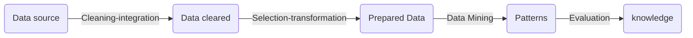
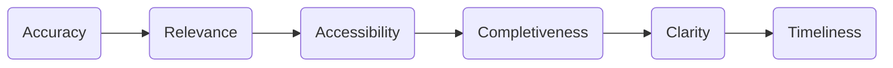

# Course 3: Data Science Methodology 

**What you'll learn:**

- Describe what a data science methodology is and why data scientists need a methodology.
- Apply the six stages in the Cross-Industry Process for Data Mining (CRISP-DM) methodology to analyze a case study.
- Evaluate which analytic model is appropriate among predictive, descriptive, and classification models used to analyze a case study.
- Determine appropriate data sources for your data science analysis methodology.

**Skills you'll gain:** Data Science, Data Analysis, Python Programming, Numpy, Pandas

## Table of Contents

- [W1 : From Problem to Approach and From Requirements to Collection](#w1--from-problem-to-approach-and-from-requirements-to-collection)
  - [Welcome - Data Science Methodology](#welcome---data-science-methodology)
  - [Introduction to CRISP-DM](#introduction-to-crisp-dm)
  - [6 Steps of CRISP-DM](#6-steps-of-crisp-dm)
  - [Business Understanding](#business-understanding)
  - [Analytic Approach](#analytic-approach)
  - [Data Requirements](#data-requirements)
  - [Data Collection](#data-collection)
- [W2 : From Understanding to Preparation and From Modeling to Evaluation](#w2--from-understanding-to-preparation-and-from-modeling-to-evaluation)
  - [Data Understanding : What means to prepare or clean data?](#data-understanding--what-means-to-prepare-or-clean-data)
  - [Data preparation process](#data-preparation-process)
  - [Data preparation - Concepts](#data-preparation---concepts)
  - [Modeling - Concepts](#modeling---concepts)
  - [Evaluation  : Does the model used really answer the initial question or does it need to be adjusted ?](#evaluation---does-the-model-used-really-answer-the-initial-question-or-does-it-need-to-be-adjusted-)
- [W3 : From Deployment to Feedback](#w3--from-deployment-to-feedback)
  - [Deployement](#deployement)
  - [Feedback](#feedback)
- [Final Exam : Credit Card Fraud Detection](#final-exam--credit-card-fraud-detection)
- [References](#references)


## W1 : From Problem to Approach and From Requirements to Collection

W1 : Syllabus

```
- Module 1: From Problem to Approach and from Requirements to Collection
- Module 2: From Understanding to Preparation and from Modeling to Evaluation
- Module 3: From Deployment to Feedback
```

### Welcome - Data Science Methodology

- Q&A Data Science ? 
- Data is every where and increasing ?
- `Methodology` : a system of methods in a particular area of study or activity
- Goal(in ds) : ensure that the data is used in problem solving is relevant and properly manipulated to address the question at handle
- course by John Rollins (IBM Analytics)

`From problem to approach`

**10 questions answered ds methodology (in netshell)**

1/ What is the problem that you are trying to solve ?
2/ How can you use data to answer the question
Working w/ data:
3/ What data do you need to answer the question ? 
4/ Where is the data comming from (identify all sources) and how will you get it ? 
5/ Is the data that you collected representative and work with the data ?
6/ what additional work is required to manipulate and work with the data ?
Deriving the answer: 
7/ In what way can the data be visualized to get to the answer that is required ?
8/ Does the model used really answer the initial question or does it need to be adjusted
9/ Can you put the model into practive ?
10/ Can you get constructive feedback into answering the question ? 
 
### Introduction to CRISP-DM
- CRISP-DM (Cross Industry Process for Data Mining ) : DS methodology is widely used similarly to Foundational Methodology of John Rollins Methodology
- Goal : increase the use of data mining over a wide variety of business applications and industries

**CRISP-DM vs Foundational Methodology** 

### 6 Steps of CRISP-DM

1. **Business Understanding**: where the intention of the project is outlined w/ the Stakeholders( Communication and clarity are important)
2. **Data Understanding**: where the Data is Collected & relies on business understanding. 
- CRISP-DM combines the stages of Data Requirements, Data Collection, and Data Understanding
3. **Data Preparation (common to Foundational Methodology)**: transformation of collected data into a useble subset.
- Check in any data is missing, or ambiguity cases 
4. **Modeling**: Choose the effient model based on the prepared data. 
 - Data mining purpose:  create useful infos
 - model: reveals patterns and structures & insight into the features of interest.  
5. **Evaluation**: where the model is tested (with generated testing data) to see its effectiveness   
6. **Deployement**: the model is used on new data outside of the scope of the dataset and by new stakeholders
- Reajustement: new variables, needs for the dataset to the model - revision : business needs and actions // Model and data 

- CRISP-DM : is flexible and cyclical model (AGILE !!!)

**DATA SCIENCE METHODOLOGY PROCESS**


### Business Understanding

- In methodology : Spending time to seek clarification for business understanding process

- From (Business) understanding to approach?
  - What's the problem that you are trying to solve ? 
  - understanding this stage is crucial to answer the CORE question : Which data needed to be used ? 
  - Understand problem == understanding the GOAL of who's asking the question
  - Goal leads to the objectives (Discussion amount stakeholders, priorities definition ..) 

`Case study`: 
- GOAL
- OBJECTIVE 
- identify the business requeriments
  - Predict the outcome
  - understanding the cause of the problem 
  - propose solution (narrative ? )

### Analytic Approach
   
- How can you use data to answer the question? 

  - identify the type of pattern to address the questions most effectively
    - Descriptive : current status
    - Diagnostic (Statistical analysis) : what happened/happenning?
    - Predictive (Forecasting) : what if these trends continue?what will happen next?
    - Prescritive : how do we solve it? 

- The correct approach depends on business requirements for the model : 
  - Predictive model : probability of an action 
  - Descriptive model : question to show relationship
  - Classification model : question YES/No  

- Machine learning when to use ? 
  - learn w/out explicitily programmed
  - identifies relationships and trends in data that might otherwise not be accessible or identified
  - Uses clustering association approach => human behaviour

`Case Study`: 

- Decision Tree classification? 
  - Predictive model: 
    - to predict the outcome
  - Decision tree classification: 
	- Categorical outcome, 
	- Explicit "decision path" showing condition leading to high risk 
	- likelihood of classified outcome 
	- Easy to understand and apply 

**Entropy** is defined as the randomness or measuring the disorder of the information being processed in Machine Learning

`From Requirements to Collection` 

### Data Requirements

Cooking with data: 
- what ingredients are required? 
- how to understand/work with them (data ingredients)
- how to prepare the data to meet the desired outcome? 

Ultime question: what are data requirements ?
- Answer the : WHO ? WHAT? WHERE ? WHEN ? WHY? HOW ?
- the necessary data content 
- formats, sources for initial datas 

`Case study`: 
- Selecting the cohort  : type of sample, charateristics, specific conditions .. 
- Define the data : contents, formats, representation for decision tree(X,Y - features) 

### Data Collection

- After the previous stage (data requirement) Collection needs more or less data ? 
- Tehcniques like statistical analysis and data viz can be used to study the data collected 

`Ultime question: What occurs during data collection?`

`Case study`:  
- Gathering available data? 
  - Available data sources (data can come from different sources*)
- Deferring inaccessible data? 
  - Data Wanted but not available
- Merging data? 
  - DBAs and dev work together to extract data from various sources and then merge it
  - Data scientist and data analytics can discuss the better ways to manage the data
    - automating certains process in the database 

` Ungraded External Tool: Ungraded External Tool From Requirements to Collection`

## W2 : From Understanding to Preparation and From Modeling to Evaluation 

### Data Understanding : What means to prepare or clean data?

- Encompasses all activities related to constructing the data
- ultime question : Is the collected data representative of the problem to be solve ? 

### Data preparation process


@To review?

`Case Study` : 
- Descriptive statistics (meaningful data analysis) : 
  - Univariate statistics
  - Pairwise corrections
  - histogram (to see how variables are distributed) : which data prep most efficient for the model
- Data quality (veracity) : 
  - Missing values? 
  - Invalid/misleading values
- iterative process (cyclique): 
  - Interative data collection and understanding
    - Refined definition of "CHF admission"

`Data quality process`



### Data preparation - Concepts

**Cleansing data** :

- removes all unwanted elements : dirt or imperfections
- most time consuming (70% - 90% of ds projects) => Automation collaction/prep process in the database=> reduce time to 50%
- data become easier to work with
- ultime question : What are the ways in which data is prepared ? 
=> Classifying data : Invalid values, missing data, removed double, formating ..

Uu6Using domain knowledge : 

- Feature engineering : Feature A,  Feature B,  Feature C ...

**Text analysis** : 
-  to ensure that the proper grouping are set

`Data Prep - Case Study : healthcare case` 

### Modeling - Concepts

- In what way can the data be visualized to get to the answer that is required?
 
**Predictive vs Descriptive Analytics?** 
- Descriptive(Optimization ) : choice, desire(if i did that i'll prefere that?)
- Predictive(Timming) : YEs/No, stop/go type outcomes 
- Statistic driven
- ML driven 

`Calibration : Using training / test sets`

- training seta used in predictive modeling (outcome already known)
- training sets : gauge to determine if any model calibration is needed
- play w/ different algos to be sure that the variable in play are required
- Understanding the question the follow is required : Constant refinement, adjustments and tweaking to ensure that the outcome is solid 

- *Was the question answered?* 

`Modeling - Case study`

 - Analyzing the 1st result of model 
 - Analytical Decision tree classification model ? (Y/N=> Predictive )
 - Adjust the parameters  : COST, ACCURACY SENSITIVITY, SPECIFICITY ?  

### Evaluation  : Does the model used really answer the initial question or does it need to be adjusted ?

- Hand-to-hand iterative stage w/ modeling 
- perfomed during model dev and before model Deployement
- requirements GOODS ? Outcome compliant w/ the custumer requeriments ? 
- **2 big stages** : 
  - diagnostic measures 
    - Predictive model : decision tree is used to see if the output is aligned to the initial design (then adjust)
    - Descriptive model : testing sets (known outcome) are applied, and model can be refined as needed
  - Statistical significance testing : 
    - data is handled/ interpreted within the model 

`Case study`: 
- Misclassification COST TUNING : 
- Tune the relative Misclassification costs
- Balance true-positive rate / false-positive rate for best model 
- Optimal model at maximum separation 
- ROC (Receiver Operating charateristic Curve)

## W3 : From Deployment to Feedback

### Deployement  

`Ultimate question: Are Stakeholders familiar w/ the new tool?` 

- Solution ?
  - Solution Owner 
  - Marketing
  - Application devs 
  - IT administration 

- The model is deployed for an ultime test
- Limited user testers / Test Environment

`Case Study`:

- Understand the results : 
  - Assimilate knowledge for business
    - Practical understand of the meaning of model results
    - Implications of model results for designing intervention actions
- Gathering Application requeriments : 
  - Application requirements 
    - Automated, near-real-time risk assessment of CHF inpatients
    - Easy to use 
    - Automated data preparation and scoring
    - Up-to-date risk assessment to help clinicians target high-risk patients
- additional requirements 
  - additional reqs : 
    - Training for clinical staff
    - Tracking / Monitoring  (developed w/ IT devs and database administration)
      - The results go then to FEEDBACK stage to refine the model over time

### Feedback

- Once in play (deployement) users feedback helps to refine the model & asset it for perfo & impact
- allows to adjust the model to meet the solution required
- Methodology is a cyclical process : refinement takes place at each stage
- Philosophy : "The more you know the more you want to know"

`From Deployement to Feedback`

- Once the model is evaluated and the data scientistis confident it will work, it is deployed and put to the ultimate test
  - Actual real-time use in the field 

`Case Study` : Applying the Concepts

- Assessment model performance : 
  - To measure results of applying the "risk model" to the outcome

`Assessment model performance`

```
					=> (Data Quality)   \\
(Domain Expertise)  => (Time)		    =>> Accuracy 
				    => (Interpretation) //
```

- Refinement
  - Initialreview of the 1st year of implementation
  - Based on feedback data and knowledge
  - Participation in intervention program 
  - Other possible refinements as yet unknown 

- Redeployement 
  - Review and refine intervention actions
  - Redeploy 
    - Continue modeling, deployement, feedback, and refinement throughout the life of the intervention program 

## Final Exam : Credit Card Fraud Detection

**Description** : Build a ML solution to detection if a particular transaction is fraudulent or Genuine?
- @todo 

## References

- [Descriptive Statistics: Definition, Overview, Types, Example - Investopedia](https://www.investopedia.com/terms/d/descriptive_statistics.asp)

